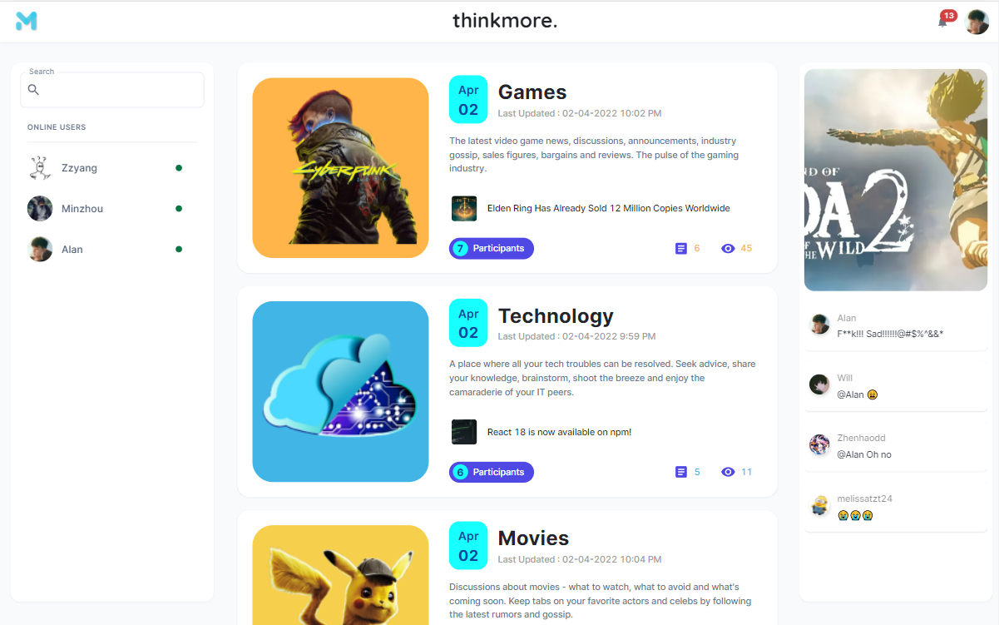

# [ThinkMoreForum-Frontend](https://www.thinkmoreapp.com/)


<p align="center">
  
</p>

## Website: [https://www.thinkmoreapp.com/](https://www.thinkmoreapp.com/)

### Backend Repo: [https://github.com/Qiming-Liu/ThinkMoreForum-Backend](https://github.com/Qiming-Liu/ThinkMoreForum-Backend)

### Front-end technology stack

1. Next.js
2. React.js
3. Redux thunk
4. Typescript
5. MUI Antd
6. Axios
7. Husky
8. React testing-library Jest
9. Eslint, sass-lint, prettier

### Back-end technology stack

1. Spring boot
2. Lombok & Mapstruct
3. Flyway & PostgreSQL (JPA)
4. Swagger & Postman
5. Spring Security & JWT
6. Jacoco & Unit Test
7. Gradle
8. RabbitMQ (amqp)
9. Amazon S3 (MinIO)
10. Redis (Jedis)
11. Sockjs (websocket)
12. Sendgrid (Email)
13. Grafana
14. Portainer.io

### Technology stack and architecture diagram

<p align="center">
  
</p>

### Install dependencies

```shell
$ yarn
```

### LiveReload Development

```shell
$ yarn
```

### [Build for Production](https://nextjs.org/docs/deployment)

```shell
$ yarn build
```

> The build is folder `.next`

### Run the Production

```shell
$ yarn start
```

> Only folder `.next`, `node_modules` and file `package.json` are required to run production.
