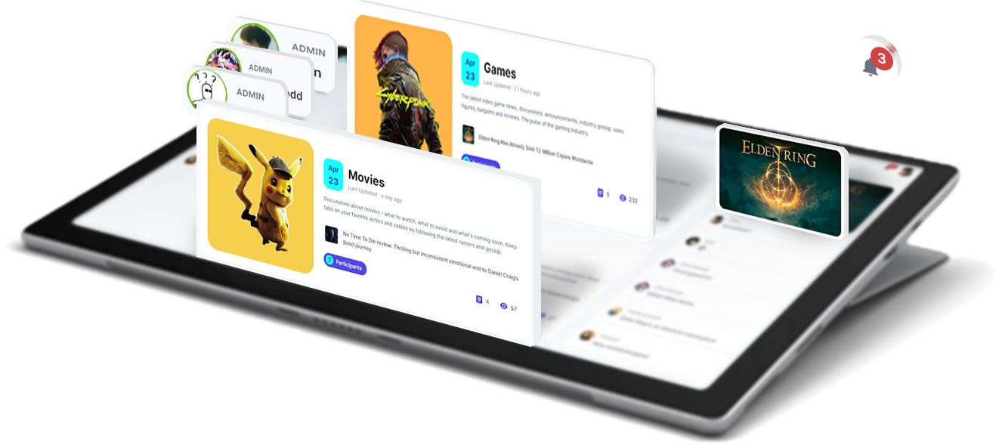

# [ThinkMoreForum-Frontend](https://www.thinkmoreapp.com/)


<p align="center"></p>

## [thinkmoreapp.com](https://www.thinkmoreapp.com/)

https://user-images.githubusercontent.com/68600416/167850826-1a155349-2daf-4b8b-b8d2-e6c9452d5020.mp4

ThinkMoreForum is a place for people to make any kind of discussion, where people come together to share their opinion. As a discussion platform, it is multifunctional, interactive, and mobile-ready. Administrators can easily set the look and topic of the forum, manage user permissions, and customize the site footer. The development process uses Jira as an agile scrum software to help the team organize and prioritize the work, and uses Github as a version control tool for a lightweight, branch-based workflow. From a technical perspective, the project uses message queues to send emails, and implements high-level JWT updates and protection, constructs WebSocket to achieve real-time online users and real-time notifications.

> The website is a preview version, which only contains the Frontend. To see the full version, please deploy a [Backend](https://github.com/Qiming-Liu/ThinkMoreForum-Backend).

## Project Architecture

<table align="center" border=0>
   <tr>
      <td width="500"><b>Front-end</b></td>
      <td width="500"><b>Back-end</b></td>
   </tr>
   <tr>
      <td>
         • Next.js<br>
         • Redux<br>
         • Typescript<br>
         • MUI<br>
         • Axios<br>
         • Husky<br>
         • Jest<br>
         • Eslint<br>
         • Sass-lint<br>
         • Prettier<br>
         • Yup, Formik
      </td>
      <td>
         • Spring boot<br>
         • Lombok & Mapstruct<br>
         • Flyway & PostgreSQL (JPA)<br>
         • Swagger & Postman<br>
         • Spring Security & JWT<br>
         • Jacoco & Mockito<br>
         • RabbitMQ (amqp)<br>
         • Amazon S3 (MinIO)<br>
         • Redis (Jedis)<br>
         • Sockjs (websocket)<br>
         • Sendgrid (Email)
      </td>
   </tr>
</table>

[](https://heroku.com/deploy)


## Project Development and Deployment

### Install dependencies

```shell
$ yarn
```

### LiveReload Development

```shell
$ yarn dev
```

### [Build for Production](https://nextjs.org/docs/deployment)

```shell
$ yarn build
```

> The build is folder `.next`

### Run the Production

```shell
$ yarn start
```

> Only folder `.next`, `node_modules` and file `package.json` are required to run production.
